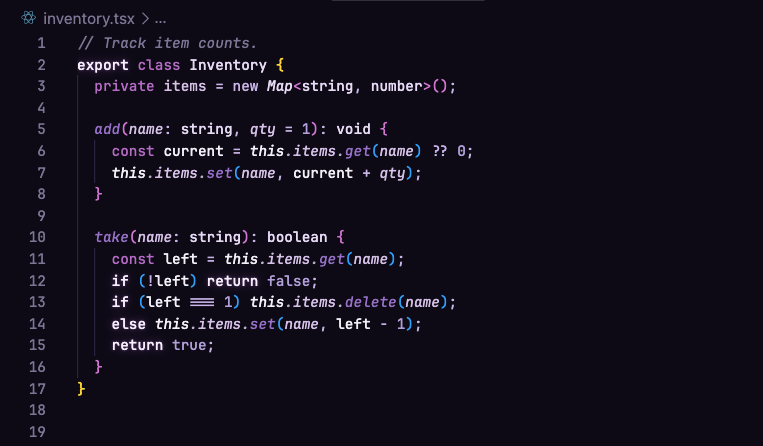
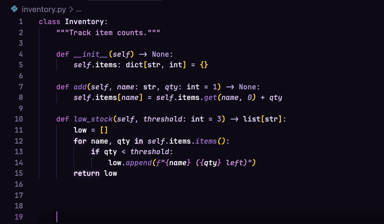
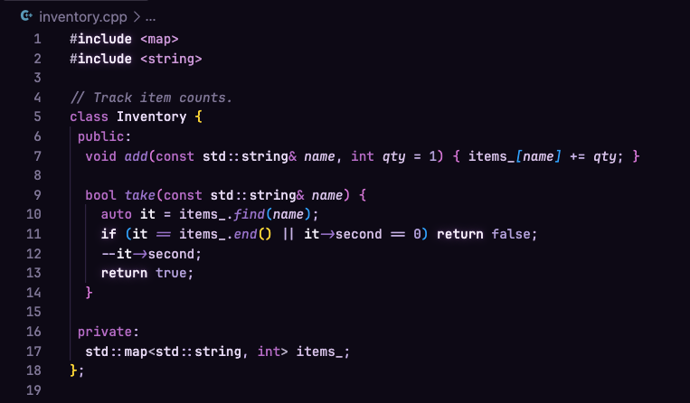
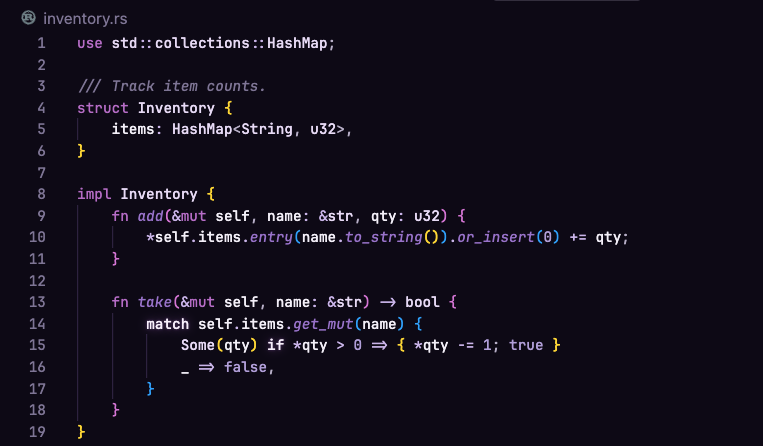
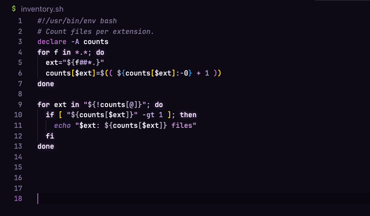

# Fifty Shades of Purple

A monochrome purple VS Code dark theme — every syntax colour is a shade of purple.

Syntax roles are separated by lightness and saturation rather than hue, and
diagnostics stay semantic — errors are still red, warnings amber — so the
purple never hides a problem.

## Screenshots

### TypeScript



### Python



### C++



### Rust



### Shell



Backgrounds sit just above pure black, and borders are real colours rather
than black-on-black, so panel edges, hover and selection stay visible.

## Install

Download the prebuilt `.vsix` from the [latest release](https://github.com/NLykoskoufis/fifty-shades-of-purple-theme/releases/latest), then either:

- VS Code → Extensions panel → `⋯` menu → **Install from VSIX…**, or
- `code --install-extension <downloaded-file>.vsix`

### From source

Requires Node.js. From the repo root:

```bash
npx @vscode/vsce package --allow-missing-repository --skip-license --out /tmp/fifty-shades-of-purple-theme.vsix
code --install-extension /tmp/fifty-shades-of-purple-theme.vsix
```

Reload the window, then pick **Fifty Shades of Purple** via `Cmd+K Cmd+T` (macOS) or `Ctrl+K Ctrl+T` (Windows/Linux).

Copying the folder into `~/.vscode/extensions/` does not work — VS Code only
loads extensions listed in `extensions.json`, which the installer writes.

## Licence

MIT — see [`LICENSE`](LICENSE).
